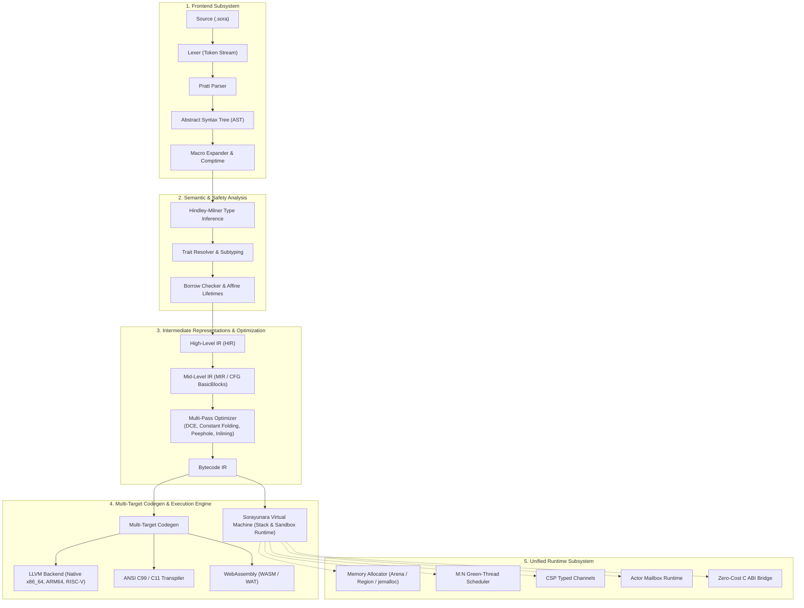

# 🌌 Sorayunara System Architecture

> **Design Philosophy**: *Python Simplicity + Rust Safety + Zero-Boilerplate Systems Performance*

Sorayunara (`.sora`) is a modern systems and general-purpose programming language compiled ahead-of-time (AOT) to native machine code (via LLVM), WebAssembly (WASM), and ANSI C transpilation, backed by an integrated high-performance bytecode runtime VM.

---

## 🏛️ Unified System Hierarchy

```
                                    Sorayunara (.sora)
                                             │
               ┌─────────────────────────────┼─────────────────────────────┐
               ▼                             ▼                             ▼
        ┌──────────────┐              ┌──────────────┐              ┌──────────────┐
        │   Compiler   │              │   Runtime    │              │    Stdlib    │
        └──────┬───────┘              └──────┬───────┘              └──────┬───────┘
               │                             │                             │
        ┌──────┴──────┐               ┌──────┴──────┐               ┌──────┴──────┐
        │             │               │             │               │             │
     ┌──▼──┐       ┌──▼───┐        ┌──▼───┐      ┌──▼───┐        ┌──▼───┐      ┌──▼──────────┐
     │Lexer│       │Parser│        │Memory│      │Async │        │  IO  │      │Collections  │
     └──┬──┘       └──┬───┘        └──┬───┘      └──┬───┘        └──┬───┘      └──┬──────────┘
        │             │               │             │               │             │
        └──────┬──────┘               └──────┬──────┘               └──────┬──────┘
               ▼                             │                             │
        ┌──────────────┐                     │                             │
        │    Typeck    │ (Hindley-Milner)    │                             │
        └──────┬───────┘                     │                             │
               ▼                             │                             │
        ┌──────────────┐                     │                             │
        │   Borrowck   │ (Affine Ownership)  │                             │
        └──────┬───────┘                     │                             │
               ▼                             │                             │
        ┌──────────────┐                     │                             │
        │   HIR / IR   │ (High/Mid/Bytecode) │                             │
        └──────┬───────┘                     │                             │
               ▼                             │                             │
        ┌──────────────┐                     │                             │
        │  Optimizer   │ (DCE/Inlining/Fold) │                             │
        └──────┬───────┘                     │                             │
               ▼                             │                             │
        ┌──────────────┐                     │                             │
        │   Codegen    │                     │                             │
        └──┬───┬───┬───┘                     │                             │
           │   │   │                         │                             │
     ┌─────┘   │   └─────┐                   │                             │
     ▼         ▼         ▼                   ▼                             ▼
  ┌──────┐  ┌─────┐  ┌──────┐      ┌──────────────────┐          ┌───────────────────┐
  │ LLVM │  │  C  │  │ WASM │      │ Sorayunara Engine│          │ 37 Core Modules   │
  │Native│  │ANSI │  │ .wat │      │ M:N Tasks/Actors │          │ Net, Crypto, ML   │
  └──────┘  └─────┘  └──────┘      └──────────────────┘          └───────────────────┘
```

---

## 🔄 End-to-End Compiler Execution Pipeline



---

## 📂 Subsystem Architectural Breakdown

### 1. Compiler Subsystem (`compiler/` & `bootstrap/src/`)
| Layer | Component | Description & Responsibilities |
|---|---|---|
| **Lexer** | `compiler/lexer/` | Fast deterministic tokenization, UTF-8 source decoding, strict keyword budget (<100 keywords). |
| **Parser** | `compiler/parser/` | Pratt operator precedence parsing for expressions (`:=`, `=>`, `|>`, `?`), structs, enums, pattern matching. |
| **AST** | `compiler/ast/` | Complete abstract syntax tree with span metadata, lossless CST representation for LSP/formatting. |
| **Typeck** | `compiler/typeck/` | Hindley-Milner bidirectional type inference, generic monomorphization, algebraic data types (ADT), type narrowing. |
| **Borrowck** | `compiler/borrowck/` | Static ownership tracker, move semantics, affine type enforcement, non-lexical lifetimes without GC overhead. |
| **Semantics** | `compiler/semantics/` | Scope resolution, symbol tables, exhaustiveness checks on pattern matching. |
| **IR / HIR** | `compiler/ir/` & `compiler/hir/` | Three-tier representation: Typed HIR -> SSA-based MIR Control Flow Graph -> Linear Bytecode IR. |
| **Optimizer** | `compiler/optimizer/` | Dead Code Elimination (DCE), jump threading, constant folding, small-function inlining, dead store elimination. |
| **Codegen** | `compiler/codegen/` | Multi-target emitters: LLVM IR (`.ll`), WebAssembly (`.wat`/`.wasm`), Portable ANSI C (`.c`), JS. |
| **Driver** | `compiler/driver/` | Incremental compilation manager, multi-threaded pipeline orchestrator, diagnostics reporting. |

---

### 2. Runtime Subsystem (`runtime/`)
| Module | Location | Capabilities & Architecture |
|---|---|---|
| **Memory** | `runtime/memory/` | Arena/Region-based memory allocation, custom slab allocator, zero-fragmentation buffers. |
| **Concurrency** | `runtime/concurrency/` | Lightweight M:N cooperative green-thread scheduler, work-stealing threadpool. |
| **Actors** | `runtime/actors/` | Erlang-inspired isolated actor mailboxes with asynchronous message passing and supervision trees. |
| **Channels** | `runtime/channels/` | CSP-style synchronous and buffered multi-producer multi-consumer (MPMC) typed channels. |
| **Async / IO** | `runtime/async/` | Event-driven non-blocking I/O multiplexer (epoll/kqueue/IOCP abstraction). |
| **FFI Bridge** | `runtime/ffi/` | Zero-overhead C calling convention (ABI) bridge for direct libc/libm and OS syscall interop. |

---

### 3. Standard Library Subsystem (`std/`)
37 comprehensive, production-grade modules grouped into core architectural domains:

```
std/
├── IO & Filesystem      ── io, fs, process, env, time
├── Networking & Web     ── net, http, websocket, grpc, dns, tls, quic
├── Concurrency & Sync   ── task, thread, sync, channel, actor
├── Data & Serialization ── collections, string, unicode, json, serialization, compression
├── Security & Crypto    ── crypto, jwt
├── Databases            ── sql, postgres, redis
├── Systems & Embedded   ── os, ffi, alloc, reflection, embedded
└── AI & Mathematics     ── math, tensor, ml, cuda
```

---

### 4. Tooling & Developer Experience Ecosystem (`tools/` & `editors/`)
- **Formatter (`tools/formatter/`)**: AST-driven canonical code formatting (`sora fmt`).
- **Linter (`tools/linter/`)**: Static code quality, style, anti-slop, and security rule enforcement (`sora lint`).
- **Debugger (`tools/debugger/`)**: Full Debug Adapter Protocol (DAP) implementation with breakpoints and stack traces.
- **Package Manager (`tools/package-manager/`)**: Cryptographic checksum lockfile generation (`sora.lock`) and package registry client.
- **IDE Integrations (`editors/`)**: Language Server Protocol (LSP) integrations for VS Code, Vim, Neovim, and Emacs.
