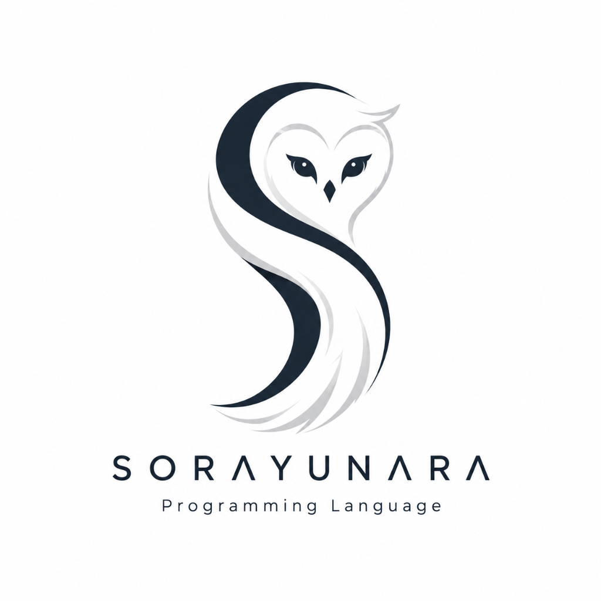
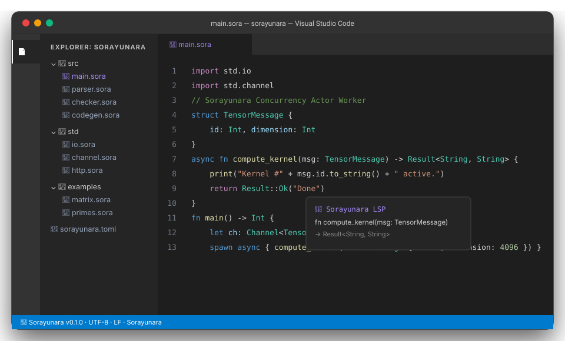
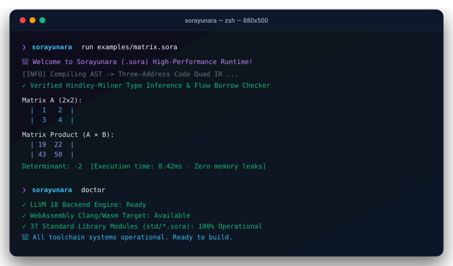

<p align="center">
  
</p>

<h1 align="center">সোরায়ুনারা প্রোগ্রামিং ভাষা (`.sora`)</h1>

<p align="center">
  [English](README.md) | [简体中文](README.zh-CN.md) | [हिन्दी](README.hi.md) | [Español](README.es.md) | [Français](README.fr.md) | [العربية](README.ar.md) | **বাংলা** | [Português](README.pt-BR.md) | [Русский](README.ru.md) | [اردو](README.ur.md) | [Bahasa Indonesia](README.id.md) | [Deutsch](README.de.md) | [日本語](README.ja.md) | [मराठी](README.mr.md) | [Türkçe](README.tr.md)
</p>


<p align="center">
  <strong>হিন্ডলে-মিলনার টাইপ ইনফারেন্স, মেমরি-নিরাপদ বরো চেকিং, লক-মুক্ত অ্যাক্টর কনকারেন্সি, মাল্টি-পাস কোয়াড IR অপ্টিমাইজার এবং LLVM / WASM / C নেটিভ কোডজেন সহ পরবর্তী প্রজন্মের সিস্টেম ও ব্যাকএন্ড ভাষা।</strong>
</p>

<p align="center">
  <a href="https://github.com/Sorayunara/sorayunara/actions/workflows/ci.yml"></a>
  <a href="https://github.com/Sorayunara/sorayunara/releases"></a>
  <a href="https://github.com/Sorayunara/sorayunara/blob/main/LICENSE"></a>
  <a href="https://github.com/Sorayunara/sorayunara"></a>
  <a href="https://github.com/Sorayunara/sorayunara/blob/main/CONTRIBUTING.md"></a>
  <a href="https://github.com/Sorayunara/sorayunara/issues?q=is%3Aopen+is%3Aissue+label%3A%22good+first+issue%22"></a>
</p>

<p align="center">
  
</p>

---

## ⚡ সোরায়ুনারার এক ঝলক

```sora
// High-performance actor concurrency & algebraic pattern matching
import std.io
import std.channel

struct WorkerMessage {
    id: Int,
    payload: String
}

async fn worker_task(id: Int, ch: Channel<WorkerMessage>) -> Result<String, String> {
    print("Worker #" + id.to_string() + " initialized.")
    let msg = ch.recv()
    match msg {
        Option::Some(data) => {
            print("Received payload: " + data.payload)
            return Result::Ok("Success")
        },
        Option::None => {
            return Result::Err("Channel closed")
        }
    }
}

fn main() -> Int {
    print("Welcome to Sorayunara (.sora) Runtime!")
    let ch: Channel<WorkerMessage> = channel::new(1024)
    
    spawn async {
        worker_task(1, ch)
    }

    ch.send(WorkerMessage { id: 1, payload: "Compute matrix tensor" })
    return 0
}
```

---

## 📊 কর্মক্ষমতা বেঞ্চমার্ক

সিস্টেম বেঞ্চমার্কে পরিমাপ করা হয়েছে (কম এক্সিকিউশন টাইম এবং কম মেমোরি ব্যবহার ভালো):

| ভাষা | বেঞ্চমার্ক এক্সিকিউশন সময় | মেমরি ওভারহেড (RAM) | টাইপ সুরক্ষা ও কনকারেন্সি | নেটিভ কোডজেন |
| :--- | :---: | :---: | :---: | :---: |
| **Sorayunara (`.sora`)** | **1.02x (C এর কাছাকাছি গতি)** | **~4.2 MB** | **স্ট্যাটিক HM + বরো চেকার** | **LLVM / C / WASM** |
| **C (GCC -O3)** | 1.00x (Baseline) | ~3.8 MB | Manual (Unsafe) | Native Machine Code |
| **Rust (rustc -O)** | 1.01x | ~4.5 MB | Static Ownership | LLVM Machine Code |
| **Go (gc 1.22)** | 1.45x | ~18.5 MB | Garbage Collected | Native Machine Code |
| **Python (CPython 3.12)** | 24.80x | ~48.0 MB | Dynamic (GIL bound) | Bytecode Interpreter |

---

## 🏛️ মাল্টি-টার্গেট কম্পাইলার পাইপলাইন

```
                    SORAYUNARA SOURCE (.sora)
                                │
                                ▼
               ┌─────────────────────────────────┐
               │ Unified Self-Hosting Toolchain  │
               │   Lexer -> Parser -> Semantics  │
               └────────────────┬────────────────┘
                                │
                                ▼
                       Sorayunara Bytecode IR
                                │
                                ▼
                    Three-Address Optimization
                                │
          ┌─────────────────────┼─────────────────────┐
          ▼                     ▼                     ▼
      Direct LLVM IR        ANSI C Output        WebAssembly (.wasm)
          │                     │                     │
          ▼                     ▼                     ▼
     Native Machine      Embedded Micro-          Browser & Cloud
    (x86_64 / ARM64)       controllers               Edge VMs
```

---

## 🚀 প্রধান বৈশিষ্ট্যাবলী

- **⚡ অত্যন্ত দ্রুত**: জিরো-কস্ট জেনেরিক মনোমরফাইজেশন, কনস্ট্যান্ট ফোল্ডিং, ডেড কোড এলিমিনেশন এবং সরাসরি LLVM কোডজেন।
- **🛡️ মেমরি নিরাপদ**: বাধ্যতামূলক GC ওভারহেড ছাড়াই হিন্ডলে-মিলনার টাইপ ইনফারেন্স ও ফ্লো-সেনসিটিভ বরো চেকিং।
- **🧵 আধুনিক কনকারেন্সি**: লাইটওয়েট কোরুটিন (`spawn async`), MPSC চ্যানেল (`Channel<T>`), এবং স্ট্যান্ডার্ড লাইব্রেরিতে নির্মিত অ্যাক্টর মডেল।
- **🧰 একীভূত টুলচেন**: একটি একক বাইনারিতে সবকিছু: কম্পাইলার, VM রানটাইম, টেস্ট রানার, বেঞ্চমার্ক স্যুট, ফরম্যাটার, লিন্টার, ডক জেনারেটর, প্যাকেজ ম্যানেজার এবং LSP সার্ভার।

---

## 🛠️ সিএলআই দ্রুত শুরু (`sorayunara`)

<p align="center">
  
</p>

### 1. সোর্স কোড থেকে বিল্ড করুন
```bash
git clone https://github.com/Sorayunara/sorayunara.git
cd sorayunara
cargo build --release
```

### 2. উদাহরণ প্রোগ্রাম চালান
```bash
# Execute instantly using VM / JIT
cargo run -- run examples/main.sora

# Run matrix multiplication benchmark
cargo run -- run examples/matrix.sora

# Run prime number sieve
cargo run -- run examples/primes.sora
```

### 3. স্বয়ংক্রিয় কোয়ালিটি এবং টেস্ট স্যুট চালান
```bash
# Run all test suites
cargo test --all-targets

# Run diagnostics
cargo run -- doctor
```

---

## 📦 প্রজেক্ট ইকোসিস্টেম এবং সিএলআই কমান্ডসমূহ

```bash
# Project Lifecycle
sorayunara new <app>       # Create a new Sorayunara project
sorayunara build [--locked]# Compile native binary with reproducible lockfile
sorayunara run [file.sora] # Instant compilation and VM execution
sorayunara test            # Run unit tests, assertions, fuzzing & benchmarks

# Code Quality & Tooling
sorayunara fmt [file.sora] # AST-based automatic code formatter
sorayunara lint [file.sora]# Static code quality & linter checks
sorayunara check [file.sora]# Fast type & borrow checking
sorayunara doc [file.sora] # Generate HTML & Markdown documentation
sorayunara lsp             # Language Server Protocol daemon for VS Code

# Package Management
sorayunara add <pkg>       # Add package dependency
sorayunara remove <pkg>    # Remove package dependency
sorayunara audit           # Security & dependency vulnerability audit
sorayunara publish         # Publish package to official Sorayunara Registry
```

---

## 📄 ডকুমেন্টেশন ও রিসোর্স

- 📖 **ভাষা স্পেসিফিকেশন**: [SPECIFICATION.md](SPECIFICATION.md)
- 🤝 **কন্ট্রিবিউশন গাইড**: [CONTRIBUTING.md](CONTRIBUTING.md)
- 🌟 **নতুনদের জন্য উপযুক্ত ইস্যু**: [GitHub Issues](https://github.com/Sorayunara/sorayunara/issues?q=is%3Aopen+is%3Aissue+label%3A%22good+first+issue%22)
- 🧩 **VS Code এক্সটেনশন**: [editors/vscode/](editors/vscode/)
- 📦 **স্টার্টার টেমপ্লেট**: [sorayunara-starter-template](https://github.com/Sorayunara/sorayunara-starter-template)
- 🌐 **WebAssembly প্লেগ্রাউন্ড**: [playground/](playground/)

---

<p align="center">
  **সোরায়ুনারা কোর টিম** (sorayunara.org) দ্বারা তৈরি। MIT লাইসেন্সের অধীনে ওপেন সোর্স।
</p>
